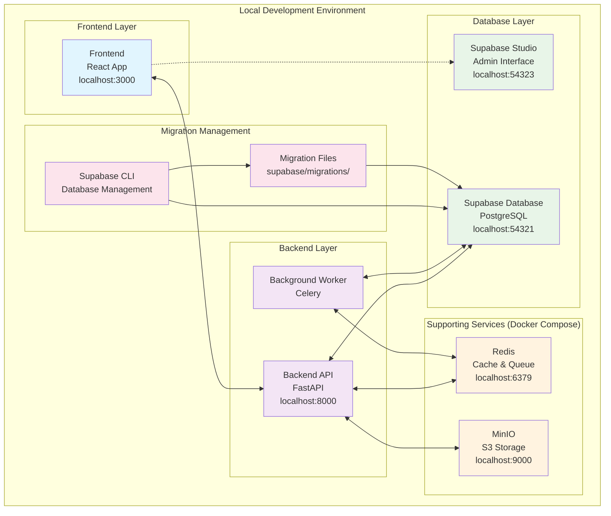
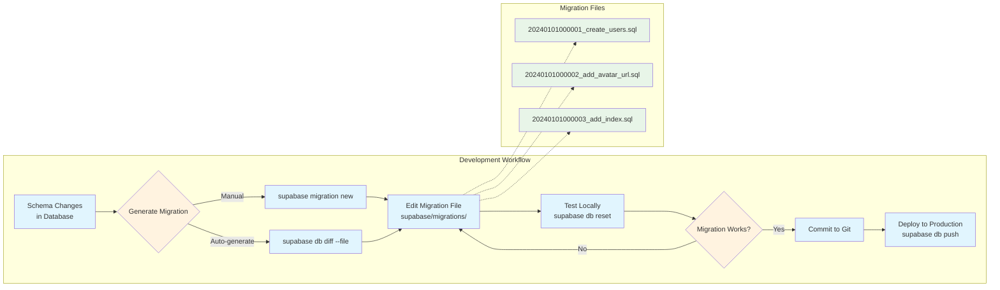
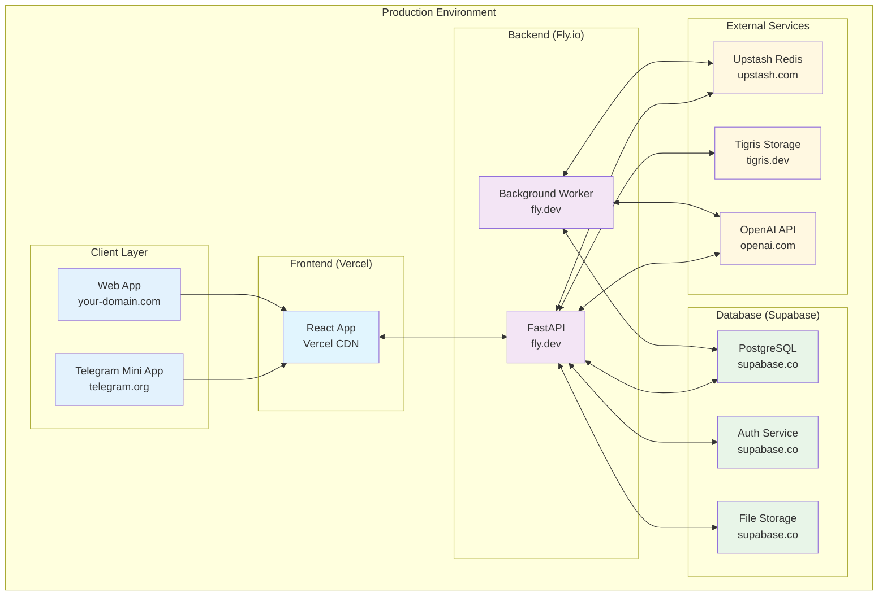

# Database Setup and Migration Guide

This project uses **Supabase** for database management with **local development** via Supabase CLI. This approach provides a seamless development experience with proper migration management.

## 🏗️ Architecture Overview



## 🚀 Quick Start

### 1. Install Supabase CLI

```bash
# Install globally
npm install -g supabase

# Or use alternative methods:
# Homebrew: brew install supabase/tap/supabase
# Direct download: See https://supabase.com/docs/guides/cli
```

### 2. Start Local Database

```bash
# From project root
supabase db start
```

This will:
- Start PostgreSQL on `localhost:54321`
- Start Supabase Studio on `localhost:54323`
- Apply migrations from `supabase/migrations/`
- Provide API keys for development

### 3. Configure Environment

```bash
# Copy environment template
cd backend
cp env.template .env

# Use the keys provided by `supabase db start` output
# Or use the default development keys (already in template)
```

### 4. Start Supporting Services

```bash
# Start Redis and MinIO with Docker Compose
docker-compose up redis minio

# Or start everything (excluding database since it's managed by Supabase)
docker-compose up
```

### 5. Start Backend

```bash
cd backend
make dev
# OR manually: uv run uvicorn calorie_track_ai_bot.main:app --reload
```

### 6. Start Frontend

```bash
cd frontend
npm run dev
```

## 📊 Database Management

### Local Development

The Supabase CLI manages the local database completely:

- **Database**: PostgreSQL running in Docker (managed by Supabase CLI)
- **Migrations**: Stored in `supabase/migrations/`
- **Schema**: Defined in migration files
- **Studio**: Web interface at `http://localhost:54323`
- **API**: Available at `http://localhost:54321`

### Migration Workflow



#### Creating Migrations

```bash
# Generate a new migration
supabase db diff --file new_migration_name

# OR create manually
supabase migration new migration_name
```

#### Applying Migrations

```bash
# Apply all pending migrations
supabase db push

# Reset database and apply all migrations
supabase db reset
```

#### Viewing Migration Status

```bash
# Check migration status
supabase migration list

# View SQL for a specific migration
cat supabase/migrations/20240101000000_migration_name.sql
```

### Schema Management

All schema changes should be done via migrations:

1. **Never** modify the database directly in production
2. **Always** create migration files for schema changes
3. **Test** migrations locally before deploying
4. **Use** `supabase db diff` to generate migrations from schema changes

### Production Deployment

For production deployment:

1. **Push migrations** to Supabase project:
   ```bash
   supabase db push --project-ref your-project-ref
   ```

2. **Link local project** to production:
   ```bash
   supabase link --project-ref your-project-ref
   ```

3. **Deploy functions** (if any):
   ```bash
   supabase functions deploy
   ```

## 🔧 Development Commands

### Backend Makefile Commands

```bash
# Database management
make db-start      # Start Supabase database
make db-stop       # Stop Supabase database
make db-reset      # Reset and reapply all migrations
make db-migrate    # Apply pending migrations
make db-types      # Generate TypeScript types

# Development
make setup         # Complete setup (excludes DB start)
make dev           # Start development server
make test          # Run tests
```

### Direct Supabase Commands

```bash
# Core database operations
supabase db start                    # Start local database
supabase db stop                     # Stop local database
supabase db reset                    # Reset database and apply migrations
supabase db push                     # Apply local migrations to database

# Migration management
supabase migration new <name>        # Create new migration
supabase migration list              # List all migrations
supabase db diff --file <name>       # Generate migration from schema diff

# Type generation
supabase gen types typescript --local > types.ts

# Project management
supabase link --project-ref <ref>    # Link to remote project
supabase status                      # Show service status
```

## 🐳 Docker Compose Integration

The `docker-compose.yml` is configured to work with Supabase CLI:

### What's Included in Docker Compose:
- ✅ **Redis** (for caching and queues)
- ✅ **MinIO** (for S3-compatible object storage)
- ✅ **Backend API** (FastAPI application)
- ✅ **Frontend** (React development server)
- ✅ **Worker** (Background job processor)

### What's NOT in Docker Compose:
- ❌ **PostgreSQL** (managed by Supabase CLI)
- ❌ **PgAdmin** (replaced by Supabase Studio)

### Environment Variables

The Docker Compose services use:
- `SUPABASE_URL=http://host.docker.internal:54321`
- Default development keys (or from environment)
- `host.docker.internal` to connect from containers to host services

## 🔍 Troubleshooting

### Common Issues

1. **"Database connection failed"**
   ```bash
   # Ensure Supabase is running
   supabase status

   # Restart if needed
   supabase db stop && supabase db start
   ```

2. **"Migration failed"**
   ```bash
   # Check migration syntax
   supabase db reset

   # If that fails, check the migration file syntax
   ```

3. **"Port already in use"**
   ```bash
   # Check what's using the port
   lsof -i :54321

   # Stop conflicting services or change ports
   ```

4. **"Docker can't connect to database"**
   ```bash
   # Ensure using host.docker.internal in Docker Compose
   # Check if Supabase is accessible from containers
   docker run --rm alpine/curl curl -f http://host.docker.internal:54321/health
   ```

### Configuration Verification

```bash
# Check Supabase status
supabase status

# Test database connection
curl http://localhost:54321/health

# Verify API connectivity
curl http://localhost:8000/health/connectivity
```

## 📝 Migration Examples

### Creating a New Table

```sql
-- supabase/migrations/20240101000000_create_users_table.sql
CREATE TABLE users (
    id UUID PRIMARY KEY DEFAULT gen_random_uuid(),
    telegram_id BIGINT UNIQUE NOT NULL,
    first_name TEXT,
    last_name TEXT,
    username TEXT,
    language_code TEXT DEFAULT 'en',
    created_at TIMESTAMP WITH TIME ZONE DEFAULT NOW(),
    updated_at TIMESTAMP WITH TIME ZONE DEFAULT NOW()
);

-- Enable RLS
ALTER TABLE users ENABLE ROW LEVEL SECURITY;

-- Create policies (example)
CREATE POLICY "Users can view own data" ON users
    FOR SELECT USING (auth.uid()::text = id::text);
```

### Adding a Column

```sql
-- supabase/migrations/20240101000001_add_avatar_url.sql
ALTER TABLE users ADD COLUMN avatar_url TEXT;
```

### Creating an Index

```sql
-- supabase/migrations/20240101000002_add_telegram_id_index.sql
CREATE INDEX idx_users_telegram_id ON users (telegram_id);
```

## 🚀 Production Deployment

### Production Architecture



### 1. Set up Supabase Project

1. Create project at [supabase.com](https://supabase.com)
2. Note your project reference and API keys
3. Configure environment variables

### 2. Deploy Migrations

```bash
# Link to production
supabase link --project-ref your-project-ref

# Push migrations
supabase db push

# Deploy any functions
supabase functions deploy
```

### 3. Update Environment Variables

```env
# Production environment
SUPABASE_URL=https://your-project-ref.supabase.co
SUPABASE_ANON_KEY=your-production-anon-key
SUPABASE_SERVICE_ROLE_KEY=your-production-service-role-key
```

## 📚 Additional Resources

- [Supabase CLI Documentation](https://supabase.com/docs/guides/cli)
- [Migration Guide](https://supabase.com/docs/guides/cli/local-development)
- [Database Functions](https://supabase.com/docs/guides/database/functions)
- [Row Level Security](https://supabase.com/docs/guides/auth/row-level-security)

This setup provides a robust, scalable database management system that works seamlessly in development and production environments.
