# Calorie Track AI Bot - System Architecture

## Overview

The Calorie Track AI Bot is a comprehensive Telegram-based application that uses computer vision to analyze food photos and provide detailed nutritional information. The system consists of multiple components working together to deliver a seamless user experience.

## High-Level Architecture

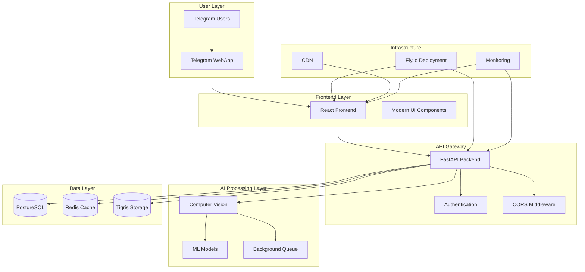

## Component Architecture

### Frontend Architecture

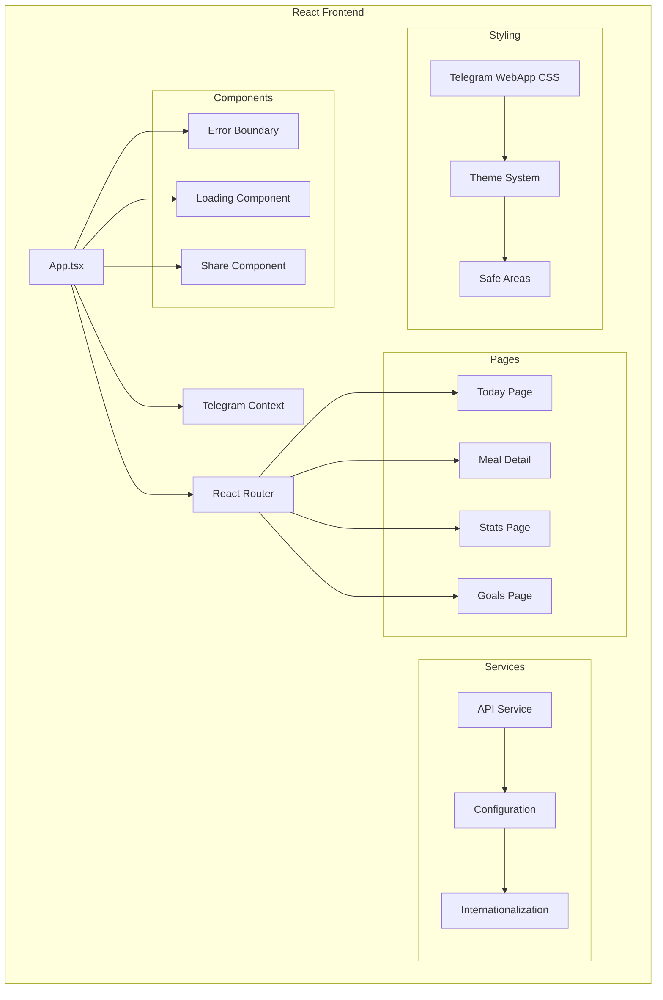

### Backend Architecture

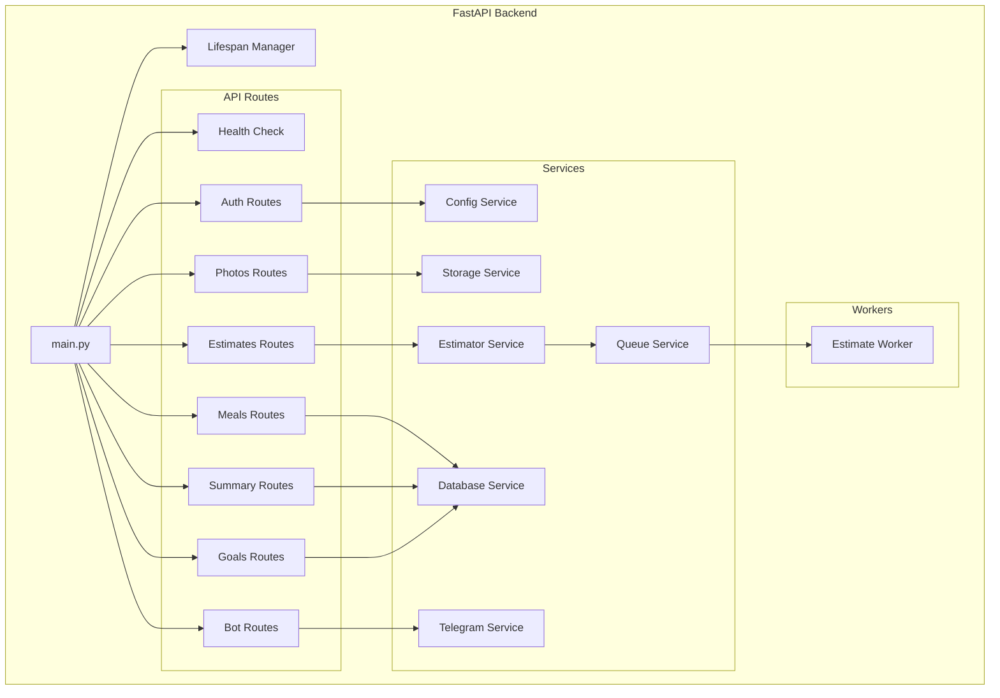

## Data Flow Architecture

### Photo Upload and Processing Flow

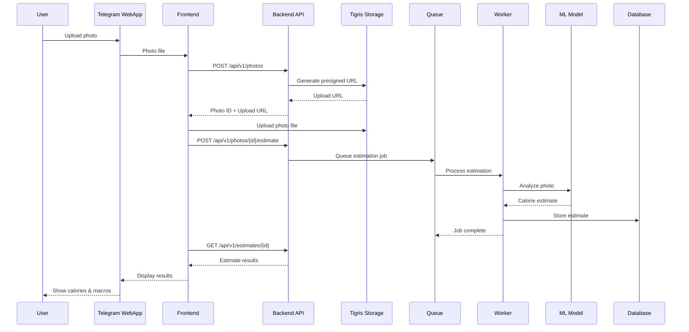

### Authentication Flow

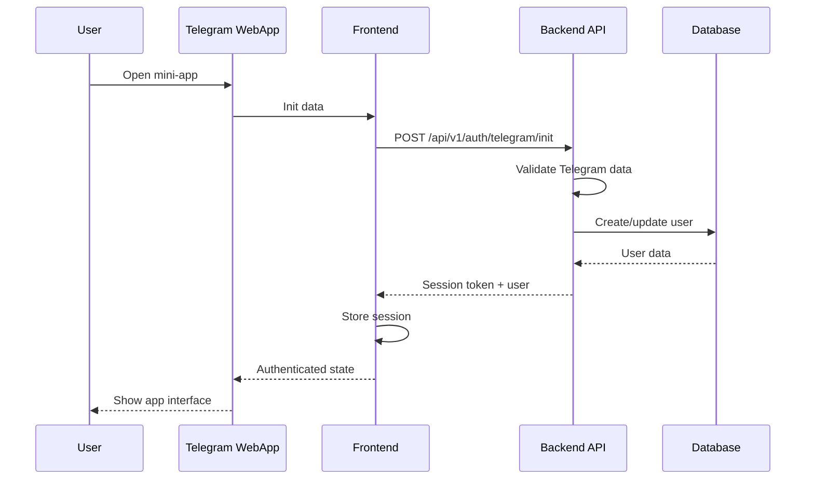

## Deployment Architecture

### Development Environment

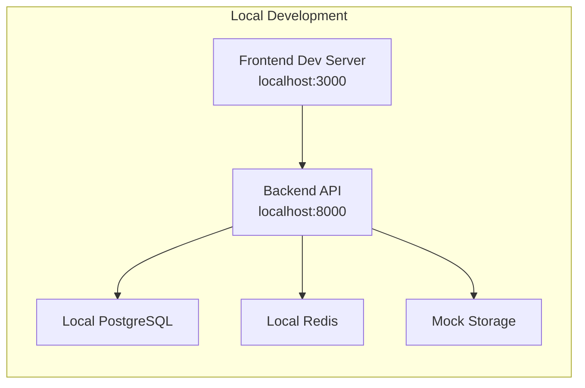

### Production Environment

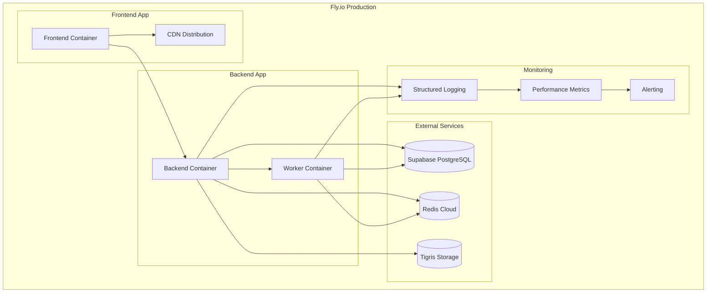

## Environment Configuration

### Development vs Production

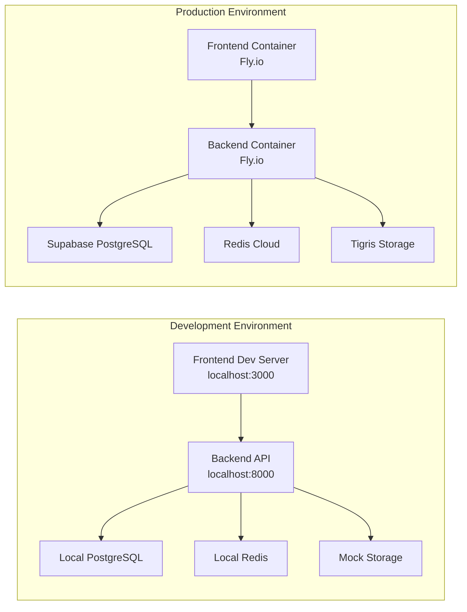

## Integration Points

### Frontend-Backend Integration

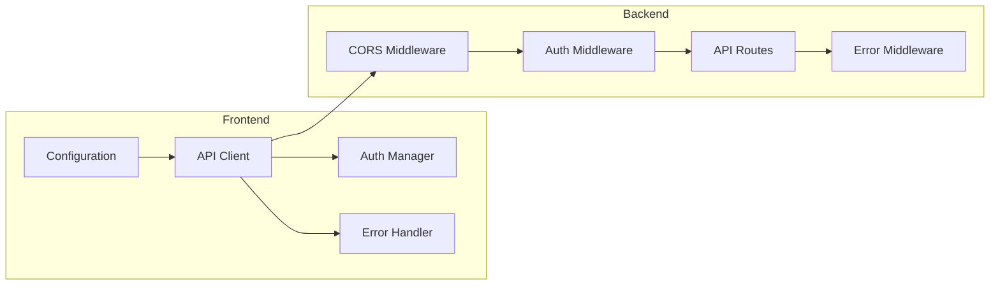

## Technology Stack

### Frontend Technologies
- **React 18**: Modern React with hooks and concurrent features
- **TypeScript**: Type-safe development
- **Vite**: Fast build tool and dev server
- **React Router**: Client-side routing
- **Axios**: HTTP client with interceptors
- **CSS Custom Properties**: Dynamic theming
- **Telegram WebApp API**: Native Telegram integration

### Backend Technologies
- **FastAPI**: Modern Python web framework
- **PostgreSQL**: Primary database
- **Redis**: Caching and session storage
- **Celery**: Background task processing
- **Tigris**: S3-compatible object storage
- **OpenAI API**: AI model integration
- **Telegram Bot API**: Bot functionality

### Infrastructure Technologies
- **Fly.io**: Container deployment platform
- **Docker**: Containerization
- **GitHub Actions**: CI/CD pipeline
- **Supabase**: Database hosting
- **Structured Logging**: Observability
- **Health Checks**: Monitoring

## Security Architecture

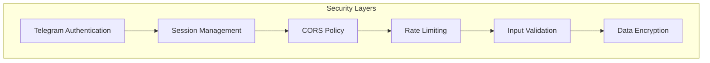

## Performance Architecture

### Caching Strategy

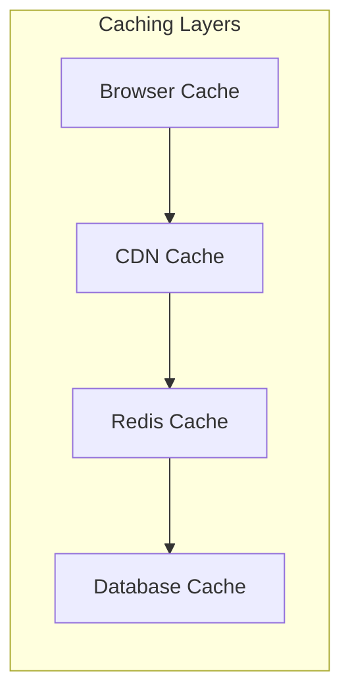

### Optimization Strategies
- **Frontend**: Code splitting, lazy loading, image optimization
- **Backend**: Database indexing, query optimization, connection pooling
- **Infrastructure**: CDN distribution, container optimization
- **Monitoring**: Performance metrics, resource usage tracking

## Monitoring and Observability

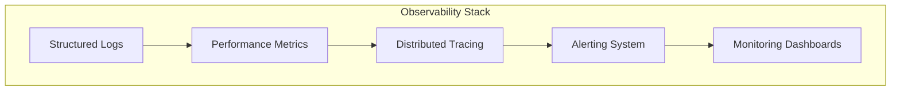

## Development Workflow

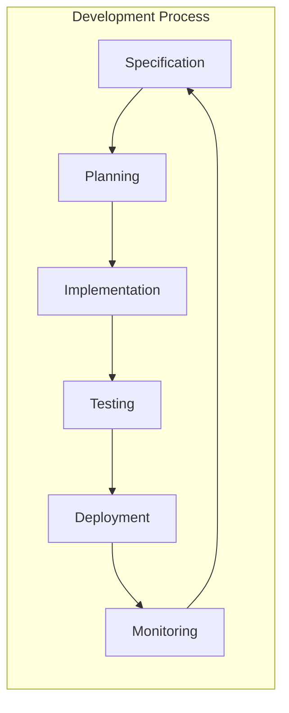

This architecture documentation provides a comprehensive view of the Calorie Track AI Bot system, showing how all components interact and work together to deliver a robust, scalable, and maintainable application.
