# Calorie Track AI Bot - System Architecture

## Overview

The Calorie Track AI Bot is a comprehensive Telegram Mini App that uses AI-powered computer vision to analyze food photos and provide detailed nutritional information. The system features a modern, mobile-first design with automatic theme detection, multi-language support, and enterprise-grade observability. The architecture prioritizes scalability, performance, and developer experience.

## High-Level Architecture

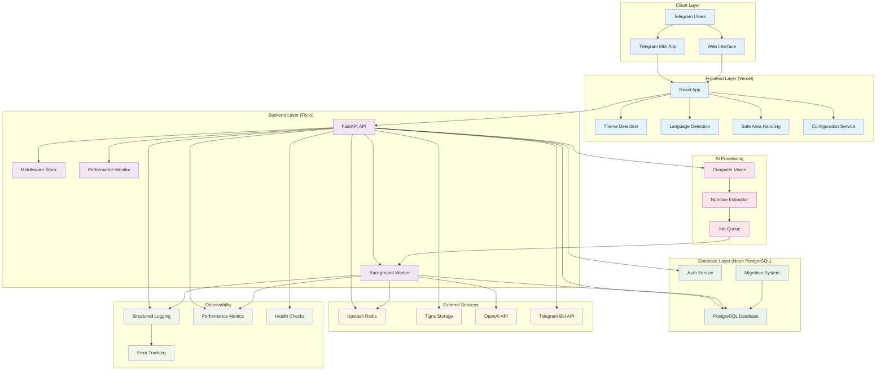

## Inline Mode Pipeline

Inline photo analysis introduces an additional fast-path inside the existing architecture. The diagram below highlights the components that participate in the inline acknowledgement (≤3 s) and result delivery (≤10 s) SLAs while maintaining the 24 hour retention boundary for transient artifacts.

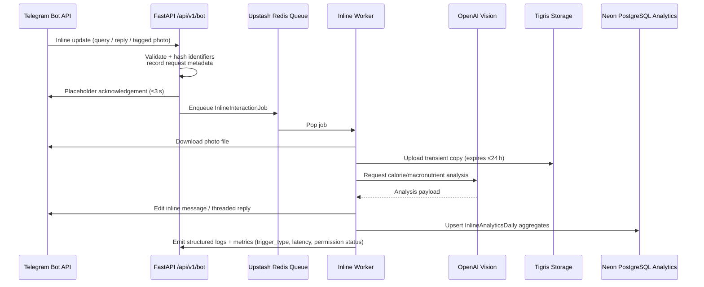

**Throughput target**: the inline queue is dimensioned for 60 jobs per minute with bursts up to 5 RPS across active groups, matching the plan’s scaling assumptions. The worker pool scales horizontally once Redis pending counts exceed thresholds logged via the telemetry hooks.

**Privacy boundary**: chat and user identifiers are salted + hashed before leaving the webhook, and only aggregate analytics (success/failure counts, latency, accuracy within tolerance, permission block counts) reach PostgreSQL. Transient photos uploaded to Tigris are purged within 24 hours by the existing cleanup routine.

## Component Architecture

### Frontend Architecture

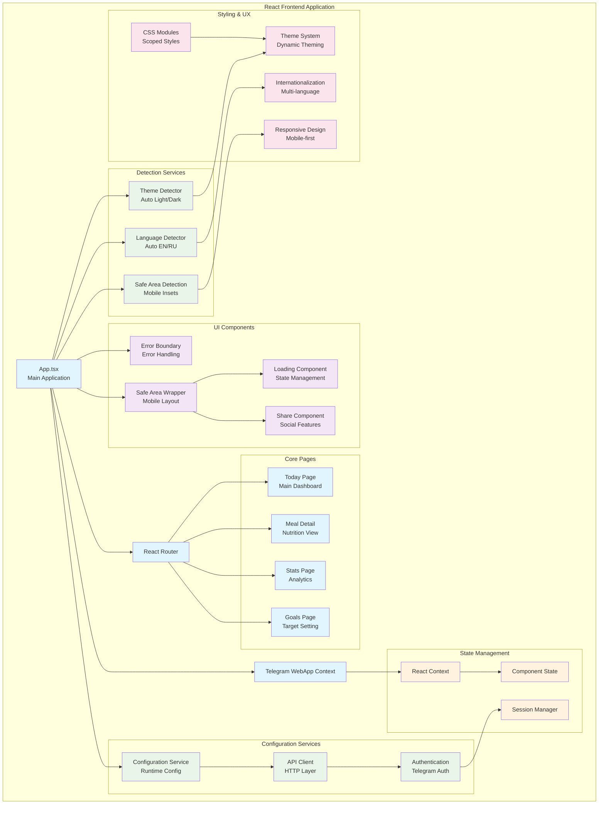

### Backend Architecture

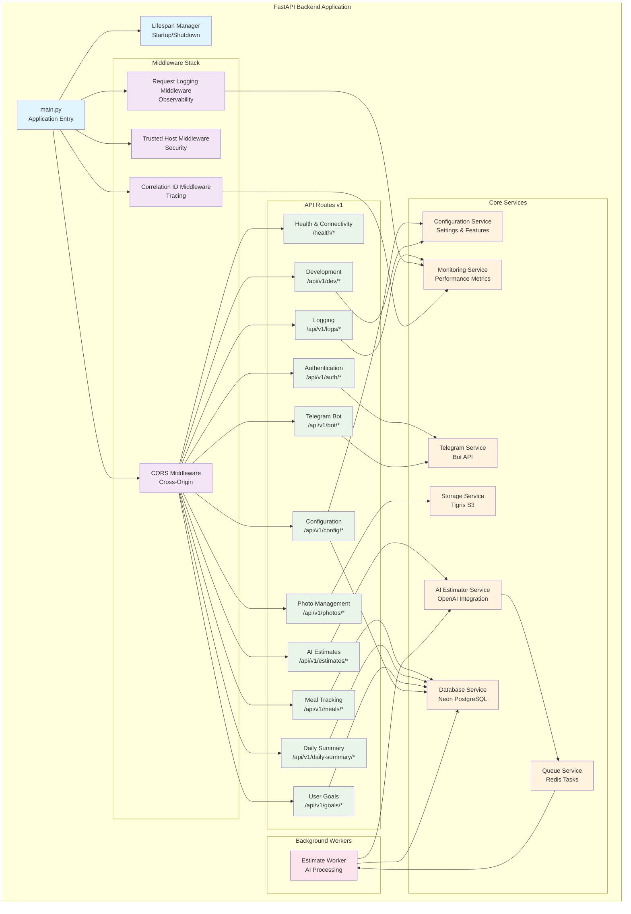

## Data Flow Architecture

### Photo Upload and Processing Flow

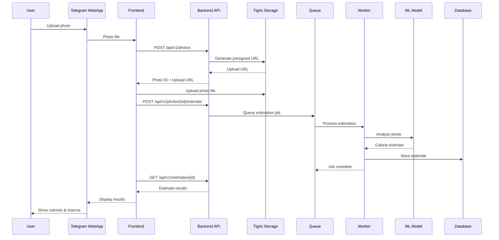

### Authentication Flow

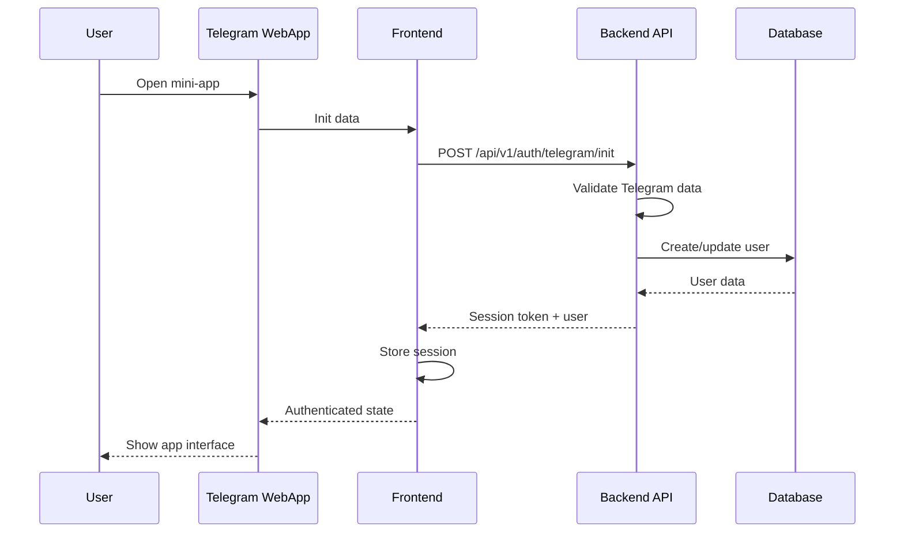

## Deployment Architecture

### Development Environment

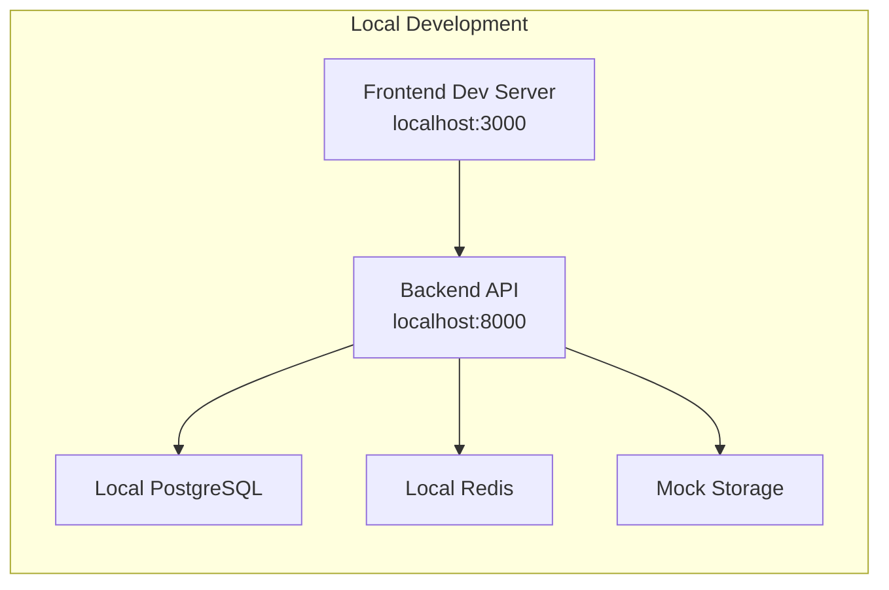

### Production Environment

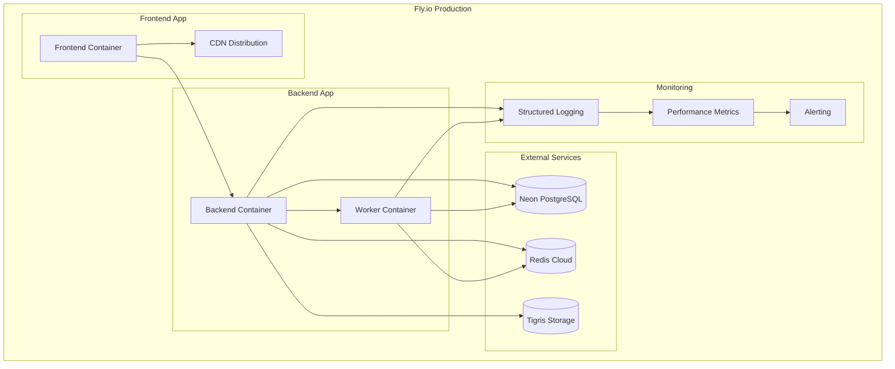

## Environment Configuration

### Development vs Production

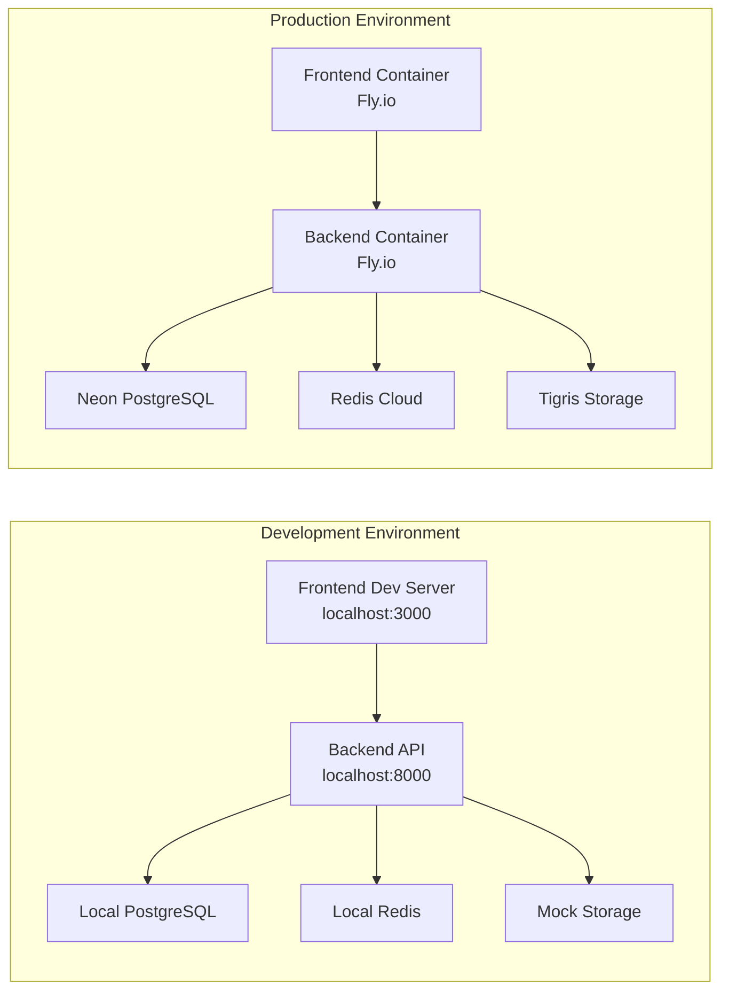

## Integration Points

### Frontend-Backend Integration

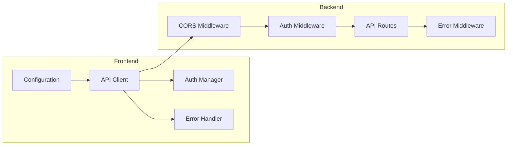

## Technology Stack

### Frontend Technologies
- **React 18**: Modern React with hooks and concurrent features
- **TypeScript**: Type-safe development with strict mode
- **Vite**: Fast build tool and dev server
- **React Router**: Client-side routing
- **Axios**: HTTP client with interceptors and correlation IDs
- **CSS Modules**: Scoped styling with dynamic theming
- **Telegram WebApp API**: Native Telegram Mini App integration
- **Zod**: Runtime type validation for configuration
- **i18next**: Internationalization (English/Russian)

### Backend Technologies
- **FastAPI**: Modern Python web framework with OpenAPI 3.1.1
- **Python 3.12**: Latest Python with type hints
- **Neon PostgreSQL**: Serverless PostgreSQL database (via psycopg3)
- **Upstash Redis**: Serverless Redis for caching and queues
- **Tigris**: S3-compatible object storage
- **OpenAI API**: GPT-5-mini for nutrition analysis
- **Telegram Bot API**: Bot functionality and webhooks
- **Structlog**: Structured logging with correlation IDs
- **Pydantic v2**: Data validation and serialization
- **psutil**: System monitoring and performance metrics

### Infrastructure Technologies
- **Fly.io**: Container deployment platform for backend
- **Vercel**: Edge deployment for frontend
- **Docker**: Containerization with multi-stage builds
- **Neon**: Serverless PostgreSQL with branching
- **GitHub Actions**: CI/CD pipeline
- **Performance Monitoring**: Real-time metrics collection
- **Health Checks**: Comprehensive connectivity monitoring
- **Correlation IDs**: Distributed tracing

## Security Architecture

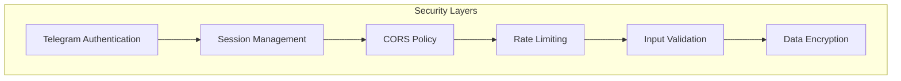

## Performance Architecture

### Caching Strategy

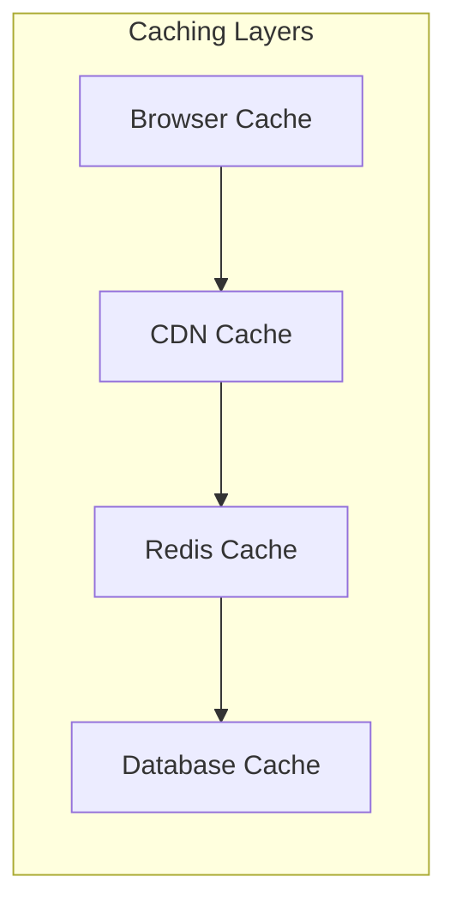

### Optimization Strategies
- **Frontend**: Code splitting, lazy loading, image optimization
- **Backend**: Database indexing, query optimization, connection pooling
- **Infrastructure**: CDN distribution, container optimization
- **Monitoring**: Performance metrics, resource usage tracking

## Monitoring and Observability

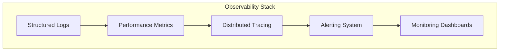

## Development Workflow

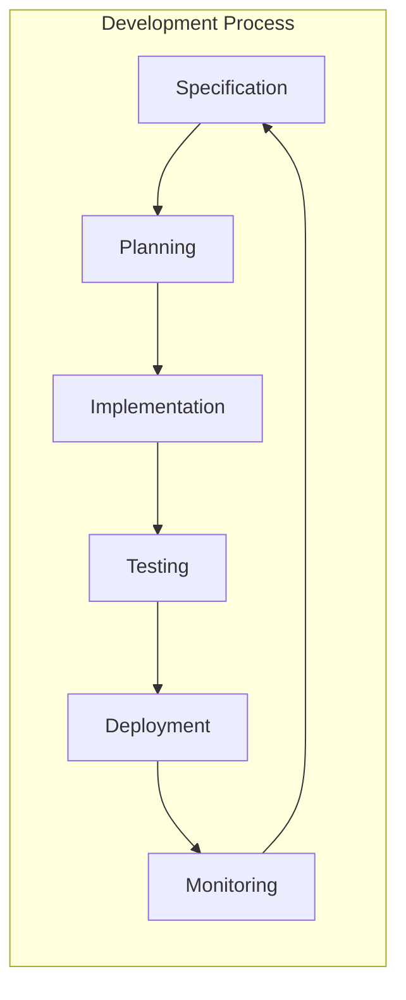

This architecture documentation provides a comprehensive view of the Calorie Track AI Bot system, showing how all components interact and work together to deliver a robust, scalable, and maintainable application.
