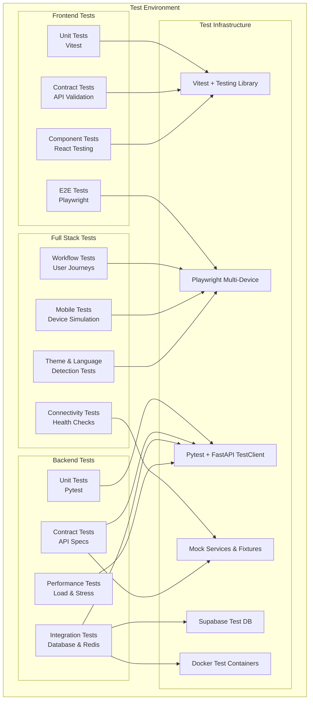
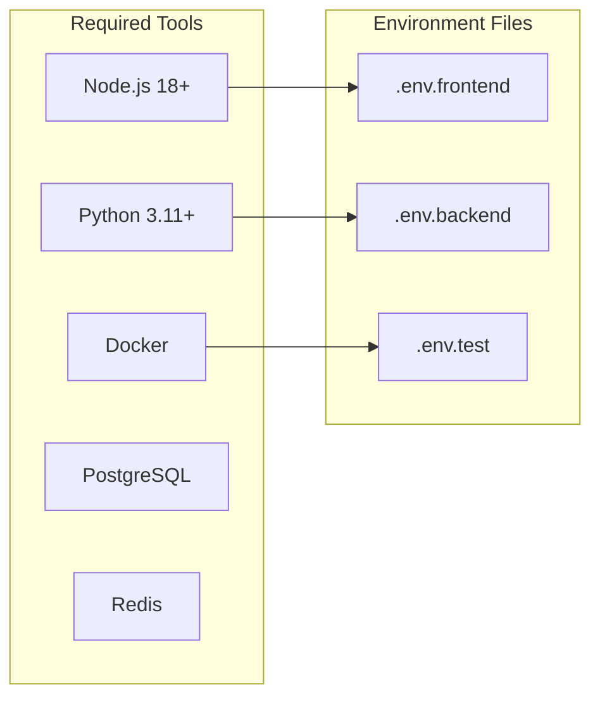
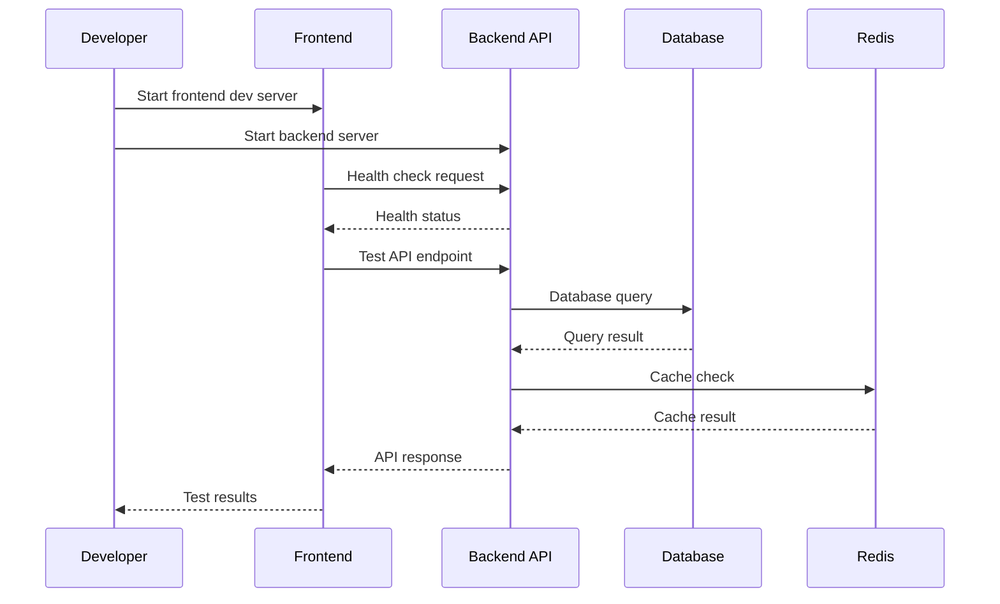
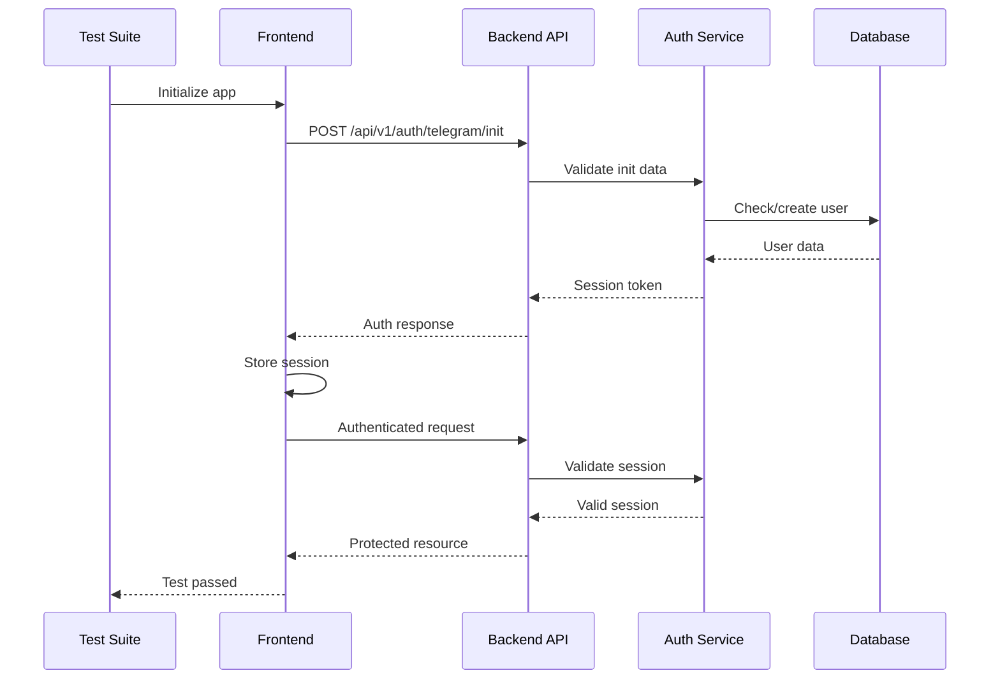
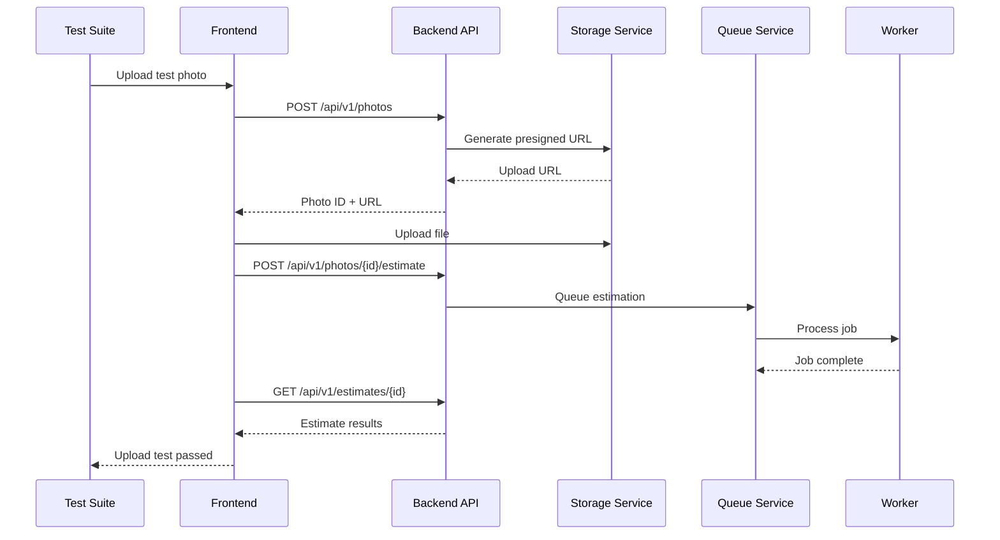
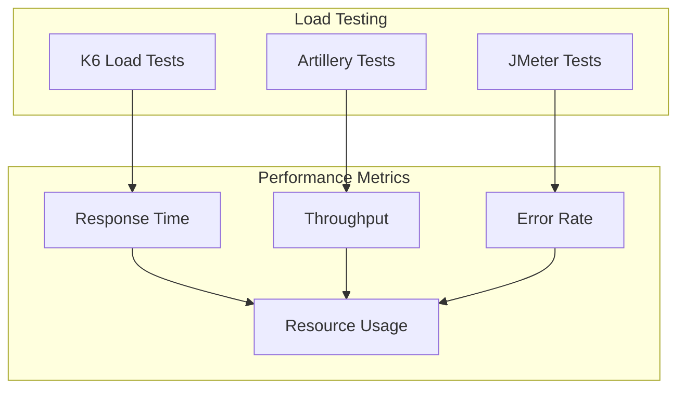
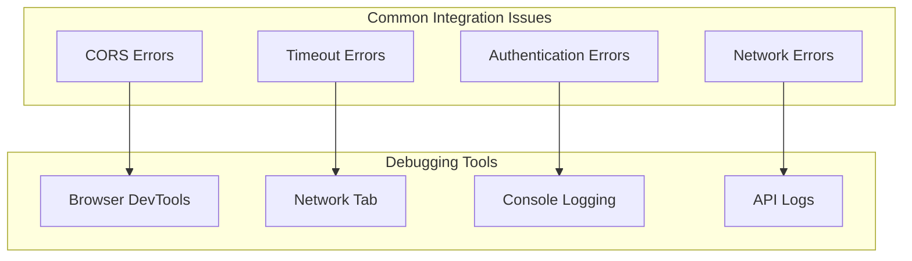
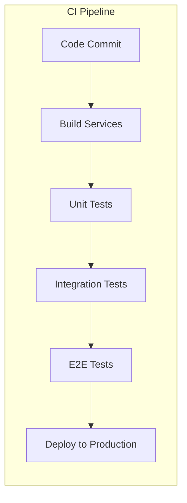

# Integration Testing Guide

## Overview

This guide provides comprehensive instructions for testing the integration between the frontend and backend components of the Calorie Track AI Bot system. It covers contract testing, API integration, E2E testing, performance validation, and mobile device testing for the Telegram Mini App.

## Integration Test Architecture



## Local Testing Setup

### Prerequisites



### Environment Configuration

#### Frontend Environment (.env.frontend)
```bash
# API Configuration
VITE_API_BASE_URL=http://localhost:8000
VITE_API_TIMEOUT=30000

# Development Features
VITE_ENABLE_DEBUG_LOGGING=true
VITE_ENABLE_ERROR_REPORTING=false
VITE_ENABLE_ANALYTICS=false
VITE_ENABLE_DEV_TOOLS=true

# Telegram Configuration (for testing)
VITE_TELEGRAM_BOT_NAME=test_bot
VITE_TELEGRAM_APP_URL=http://localhost:3000

# Production Configuration
# VITE_API_BASE_URL=https://calorie-track-ai-bot.fly.dev
# VITE_ENABLE_DEBUG_LOGGING=false
# VITE_ENABLE_ERROR_REPORTING=true
# VITE_ENABLE_ANALYTICS=true
# VITE_ENABLE_DEV_TOOLS=false
```

#### Backend Environment (.env.backend)
```bash
# Database Configuration
SUPABASE_URL=postgresql://localhost:5432/calorie_track_test
SUPABASE_DB_PASSWORD=test_password

# Redis Configuration
REDIS_URL=redis://localhost:6379/0

# Storage Configuration (Mock for testing)
AWS_ENDPOINT_URL_S3=http://localhost:9000
AWS_ACCESS_KEY_ID=test_key
AWS_SECRET_ACCESS_KEY=test_secret
BUCKET_NAME=test-bucket

# Telegram Configuration
TELEGRAM_BOT_TOKEN=test_token
USE_WEBHOOK=false

# Logging
LOG_LEVEL=DEBUG
APP_ENV=development
```

## Testing Workflows

### 1. Connectivity Testing



### 2. Authentication Flow Testing



### 3. Photo Upload Testing



### 4. Inline Mode Scenarios

Use these manual and automated checks when validating inline mode end-to-end. Each checklist item maps to automated coverage in `tests/api/v1/test_bot_inline.py` or `tests/integration/test_inline_*`.

- [ ] **Inline query acknowledgement** — Trigger an inline query (`@CalorieTrackAI_bot`) in a private chat and confirm the placeholder message appears within 3 seconds while the JSON response echoes the same `job_id`.
- [ ] **Private inline summary** — Select the inline result and verify the final message includes calories, macronutrients, confidence, and the privacy disclosure from the quickstart guide.
- [ ] **Group reply mention** — Reply to a group photo with `@CalorieTrackAI_bot` and check that both the acknowledgement and result stay threaded via `reply_to_message_id`.
- [ ] **Tagged caption flow** — Post a group photo tagging the bot in the caption; expect the bot to reply inline or DM a fallback with admin guidance if permissions block posting, incrementing `permission_block_count`.
- [ ] **Analytics snapshot** — Query `/api/v1/analytics/inline-summary` and confirm the appropriate `trigger_counts` bucket increments for `inline_query`, `reply_mention`, or `tagged_photo`.
- [ ] **Telemetry verification** — Inspect structured logs/metrics to ensure `trigger_type`, acknowledgement latency, and result latency events were emitted for each exercised flow.

## Test Commands

### Frontend Testing

```bash
# Install dependencies
cd frontend
npm install

# Run unit tests
npm run test

# Run integration tests
npm run test:integration

# Run E2E tests
npm run test:e2e

# Start development server
npm run dev

# Build for production
npm run build
```

### Backend Testing

```bash
# Install dependencies
cd backend
uv sync

# Run unit tests
uv run pytest tests/

# Run integration tests
uv run pytest tests/integration/

# Run API tests
uv run pytest tests/api/

# Start development server
uv run uvicorn src.calorie_track_ai_bot.main:app --reload --host 0.0.0.0 --port 8000

# Run linting
uv run ruff check
uv run pyright
```

### Full Stack Testing

```bash
# Start all services
make dev-up

# Run connectivity tests
make test-connectivity

# Run integration tests
make test-integration

# Run performance tests
make test-performance

# Stop all services
make dev-down
```

## Test Scenarios

### 1. Basic Connectivity Test

```typescript
// frontend/tests/integration/connectivity.test.ts
describe('Backend Connectivity', () => {
  test('should connect to backend API', async () => {
    const response = await fetch('/health/live');
    expect(response.status).toBe(200);
    const data = await response.json();
    expect(data.status).toBe('ok');
  });

  test('should handle CORS properly', async () => {
    const response = await fetch('/api/v1/health', {
      method: 'OPTIONS',
      headers: {
        'Origin': 'http://localhost:3000',
        'Access-Control-Request-Method': 'GET',
      },
    });
    expect(response.headers.get('Access-Control-Allow-Origin')).toBeTruthy();
  });
});
```

### 2. Authentication Integration Test

```typescript
// frontend/tests/integration/auth.test.ts
describe('Authentication Integration', () => {
  test('should authenticate with Telegram init data', async () => {
    const mockInitData = 'user=%7B%22id%22%3A123%7D&auth_date=1234567890';

    const response = await authApi.initTelegramAuth(mockInitData);

    expect(response.session_token).toBeDefined();
    expect(response.user).toBeDefined();
    expect(response.user.telegram_user_id).toBe(123);
  });

  test('should maintain session across requests', async () => {
    // Authenticate first
    const authResponse = await authApi.initTelegramAuth(mockInitData);
    sessionManager.setSession(authResponse.session_token);

    // Make authenticated request
    const response = await mealsApi.getMealsByDate('2025-01-27');
    expect(response).toBeDefined();
  });
});
```

### 3. Photo Upload Integration Test

```typescript
// frontend/tests/integration/photo.test.ts
describe('Photo Upload Integration', () => {
  test('should upload photo and get estimate', async () => {
    const testFile = new File(['test image data'], 'test.jpg', {
      type: 'image/jpeg',
    });

    const { photo, estimateId } = await apiUtils.uploadPhotoAndEstimate(testFile);

    expect(photo.id).toBeDefined();
    expect(estimateId).toBeDefined();

    // Poll for estimate completion
    const estimate = await apiUtils.pollEstimate(estimateId);
    expect(estimate.status).toBe('done');
    expect(estimate.kcal_mean).toBeGreaterThan(0);
  });
});
```

## Performance Testing

### Load Testing Architecture



### Performance Test Commands

```bash
# Run K6 load tests
k6 run tests/performance/load-test.js

# Run Artillery tests
artillery run tests/performance/artillery-config.yml

# Run JMeter tests
jmeter -n -t tests/performance/api-test.jmx -l results.jtl
```

## Debugging Integration Issues

### Common Issues and Solutions



### Debugging Checklist

1. **Check CORS Configuration**
   - Verify allowed origins in backend
   - Check preflight requests
   - Validate headers

2. **Verify Authentication**
   - Check session token storage
   - Validate Telegram init data
   - Test token expiration

3. **Monitor Network Requests**
   - Check request/response headers
   - Verify API endpoints
   - Monitor response times

4. **Check Error Handling**
   - Test error scenarios
   - Verify error messages
   - Check fallback behavior

## Continuous Integration

### CI/CD Pipeline for Integration Tests



### GitHub Actions Workflow

```yaml
# .github/workflows/integration-tests.yml
name: Integration Tests

on:
  push:
    branches: [main]
  pull_request:
    branches: [main]

jobs:
  integration-tests:
    runs-on: ubuntu-latest

    services:
      postgres:
        image: postgres:15
        env:
          POSTGRES_PASSWORD: test_password
        options: >-
          --health-cmd pg_isready
          --health-interval 10s
          --health-timeout 5s
          --health-retries 5

      redis:
        image: redis:7
        options: >-
          --health-cmd "redis-cli ping"
          --health-interval 10s
          --health-timeout 5s
          --health-retries 5

    steps:
      - uses: actions/checkout@v4

      - name: Setup Node.js
        uses: actions/setup-node@v4
        with:
          node-version: '18'

      - name: Setup Python
        uses: actions/setup-python@v4
        with:
          python-version: '3.11'

      - name: Install Frontend Dependencies
        run: |
          cd frontend
          npm ci

      - name: Install Backend Dependencies
        run: |
          cd backend
          uv sync

      - name: Run Frontend Tests
        run: |
          cd frontend
          npm run test:integration

      - name: Run Backend Tests
        run: |
          cd backend
          uv run pytest tests/integration/

      - name: Run E2E Tests
        run: |
          cd frontend
          npm run test:e2e
```

This comprehensive integration testing guide provides all the tools and procedures needed to ensure reliable communication between your frontend and backend components.
