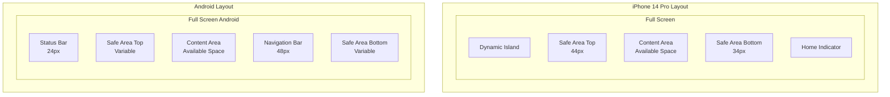
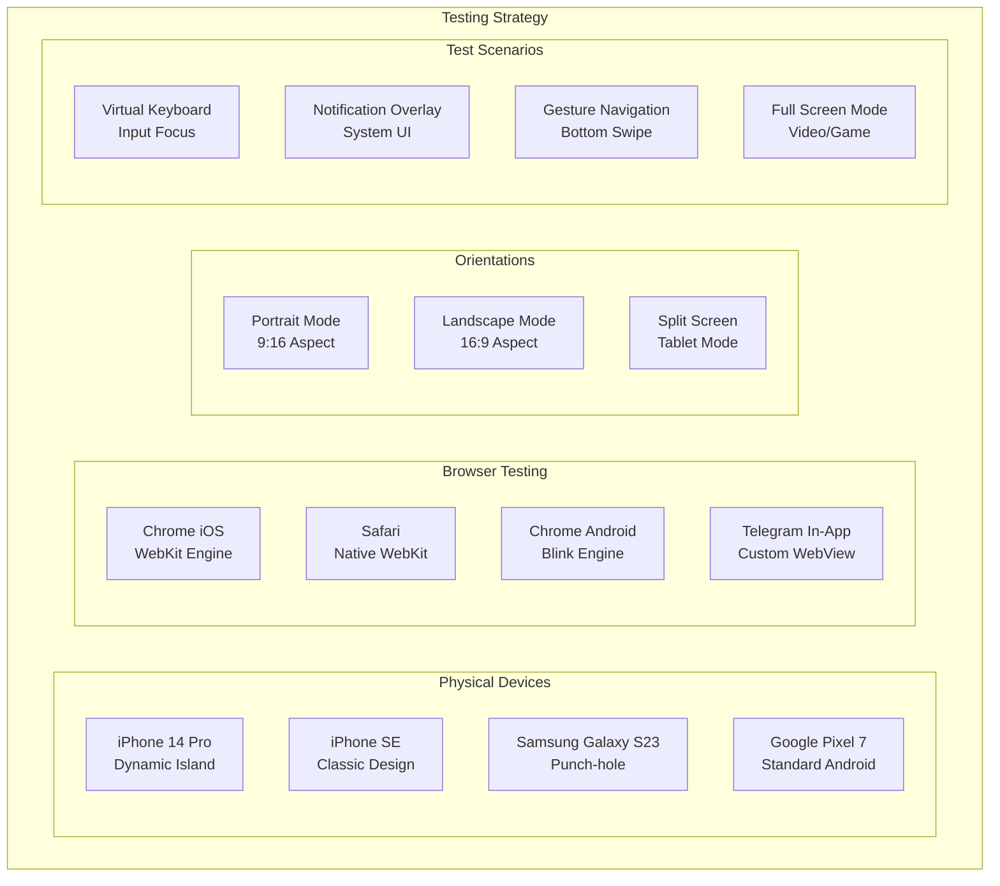

# Mobile Safe Areas Guide

## Overview

This guide provides comprehensive information about implementing mobile safe areas in the Calorie Track AI Bot Telegram Mini App. Safe areas ensure that important UI elements are not obscured by device-specific features like notches, dynamic islands, home indicators, and status bars.

## Understanding Safe Areas

### What are Safe Areas?



### Device-Specific Safe Areas

| Device | Top Safe Area | Bottom Safe Area | Notes |
|--------|---------------|------------------|-------|
| iPhone 14 Pro | 44px | 34px | Dynamic Island |
| iPhone 14 | 44px | 34px | Notch |
| iPhone SE | 20px | 0px | Classic design |
| Samsung Galaxy S23 | 24px | 48px | Punch-hole camera |
| Google Pixel 7 | 24px | 48px | Standard Android |

## Architecture Overview

### Safe Area Detection System

```mermaid
graph TD
    subgraph "Safe Area Detection Architecture"
        APP[App.tsx<br/>Main Application]
        WRAPPER[SafeAreaWrapper<br/>Container Component]
        DETECTOR[useSafeAreaDetection<br/>Custom Hook]

        subgraph "Detection Sources"
            CSS_ENV[CSS env() Variables]
            VIEWPORT_API[Visual Viewport API]
            ORIENTATION[Screen Orientation API]
            TELEGRAM[Telegram WebApp API]
        end

        subgraph "State Management"
            CONTEXT[React Context]
            LOCAL_STATE[Local State]
            BACKEND_SYNC[Backend Sync]
        end

        subgraph "UI Application"
            DYNAMIC_CSS[Dynamic CSS Properties]
            RESPONSIVE[Responsive Layout]
            CONTENT_INSETS[Content Insets]
        end
    end

    APP --> WRAPPER
    WRAPPER --> DETECTOR

    %% Detection connections
    DETECTOR --> CSS_ENV
    DETECTOR --> VIEWPORT_API
    DETECTOR --> ORIENTATION
    DETECTOR --> TELEGRAM

    %% State management
    DETECTOR --> CONTEXT
    CONTEXT --> LOCAL_STATE
    LOCAL_STATE --> BACKEND_SYNC

    %% UI application
    CONTEXT --> DYNAMIC_CSS
    DYNAMIC_CSS --> RESPONSIVE
    RESPONSIVE --> CONTENT_INSETS

    %% Styling
    classDef app fill:#e1f5fe
    classDef detection fill:#f3e5f5
    classDef state fill:#e8f5e8
    classDef ui fill:#fff3e0

    class APP,WRAPPER app
    class DETECTOR,CSS_ENV,VIEWPORT_API,ORIENTATION,TELEGRAM detection
    class CONTEXT,LOCAL_STATE,BACKEND_SYNC state
    class DYNAMIC_CSS,RESPONSIVE,CONTENT_INSETS ui
```

## Implementation Guide

### 1. SafeAreaWrapper Component

Our `SafeAreaWrapper` component automatically detects and applies safe area insets:

```typescript
// src/components/SafeAreaWrapper.tsx
import React, { useEffect, useState } from 'react';
import { useSafeAreaDetection } from '../hooks/useSafeAreaDetection';
import styles from './SafeAreaWrapper.module.css';

interface SafeAreaWrapperProps {
  children: React.ReactNode;
  enableAllSides?: boolean;
  className?: string;
  onSafeAreaChange?: (safeAreas: SafeAreaInsets) => void;
}

interface SafeAreaInsets {
  top: number;
  bottom: number;
  left: number;
  right: number;
}

export const SafeAreaWrapper: React.FC<SafeAreaWrapperProps> = ({
  children,
  enableAllSides = true,
  className = '',
  onSafeAreaChange,
}) => {
  const safeAreas = useSafeAreaDetection();

  useEffect(() => {
    if (onSafeAreaChange) {
      onSafeAreaChange(safeAreas);
    }
  }, [safeAreas, onSafeAreaChange]);

  return (
    <div
      className={`${styles.safeAreaWrapper} ${className}`}
      style={{
        '--safe-area-inset-top': `${safeAreas.top}px`,
        '--safe-area-inset-bottom': `${safeAreas.bottom}px`,
        '--safe-area-inset-left': `${safeAreas.left}px`,
        '--safe-area-inset-right': `${safeAreas.right}px`,
      } as React.CSSProperties}
    >
      {children}
    </div>
  );
};
```

### 2. Safe Area Detection Hook

The custom hook handles all detection logic:

```typescript
// src/hooks/useSafeAreaDetection.ts
import { useState, useEffect } from 'react';

export const useSafeAreaDetection = () => {
  const [safeAreas, setSafeAreas] = useState({
    top: 0,
    bottom: 0,
    left: 0,
    right: 0,
  });

  useEffect(() => {
    const detectSafeAreas = () => {
      // CSS Environment Variables (iOS)
      const cssTop = getCSSEnvValue('safe-area-inset-top');
      const cssBottom = getCSSEnvValue('safe-area-inset-bottom');
      const cssLeft = getCSSEnvValue('safe-area-inset-left');
      const cssRight = getCSSEnvValue('safe-area-inset-right');

      // Visual Viewport API
      const viewportHeight = window.visualViewport?.height || window.innerHeight;
      const screenHeight = window.screen.height;

      // Calculate safe areas
      setSafeAreas({
        top: cssTop || calculateTopInset(),
        bottom: cssBottom || calculateBottomInset(),
        left: cssLeft || 0,
        right: cssRight || 0,
      });
    };

    // Initial detection
    detectSafeAreas();

    // Listen for changes
    window.addEventListener('resize', detectSafeAreas);
    window.addEventListener('orientationchange', detectSafeAreas);

    if (window.visualViewport) {
      window.visualViewport.addEventListener('resize', detectSafeAreas);
    }

    return () => {
      window.removeEventListener('resize', detectSafeAreas);
      window.removeEventListener('orientationchange', detectSafeAreas);

      if (window.visualViewport) {
        window.visualViewport.removeEventListener('resize', detectSafeAreas);
      }
    };
  }, []);

  return safeAreas;
};
```

### 3. CSS Implementation

Safe area CSS using modern CSS features:

```css
/* src/components/SafeAreaWrapper.module.css */
.safeAreaWrapper {
  /* Full viewport height with safe areas */
  min-height: 100dvh;

  /* Use CSS environment variables for safe areas */
  padding-top: max(env(safe-area-inset-top), var(--safe-area-inset-top, 0px));
  padding-bottom: max(env(safe-area-inset-bottom), var(--safe-area-inset-bottom, 0px));
  padding-left: max(env(safe-area-inset-left), var(--safe-area-inset-left, 0px));
  padding-right: max(env(safe-area-inset-right), var(--safe-area-inset-right, 0px));

  /* Box sizing to include padding */
  box-sizing: border-box;

  /* Flexbox for content layout */
  display: flex;
  flex-direction: column;

  /* Ensure content doesn't overflow */
  overflow-x: hidden;

  /* Background color for safe areas */
  background-color: var(--tg-bg-color, #ffffff);
}

/* Content area within safe wrapper */
.safeAreaWrapper > * {
  flex: 1;
  width: 100%;
}

/* Debug mode for development */
.safeAreaWrapper[data-debug="true"] {
  background:
    linear-gradient(to bottom,
      rgba(255, 0, 0, 0.1) 0%,
      rgba(255, 0, 0, 0.1) env(safe-area-inset-top),
      transparent env(safe-area-inset-top),
      transparent calc(100% - env(safe-area-inset-bottom)),
      rgba(255, 0, 0, 0.1) calc(100% - env(safe-area-inset-bottom)),
      rgba(255, 0, 0, 0.1) 100%
    );
}

/* Responsive breakpoints */
@media (max-width: 768px) {
  .safeAreaWrapper {
    /* Ensure minimum safe areas on small screens */
    padding-top: max(env(safe-area-inset-top), 20px);
    padding-bottom: max(env(safe-area-inset-bottom), 20px);
  }
}

/* Landscape orientation adjustments */
@media (orientation: landscape) and (max-height: 500px) {
  .safeAreaWrapper {
    /* Reduce vertical padding in landscape */
    padding-top: max(env(safe-area-inset-top), 10px);
    padding-bottom: max(env(safe-area-inset-bottom), 10px);

    /* Increase horizontal padding */
    padding-left: max(env(safe-area-inset-left), 16px);
    padding-right: max(env(safe-area-inset-right), 16px);
  }
}

/* Telegram-specific adjustments */
.telegram-webapp .safeAreaWrapper {
  /* Telegram WebApp specific safe areas */
  background-color: var(--tg-bg-color);
  color: var(--tg-text-color);
}

/* Dark theme support */
[data-theme="dark"] .safeAreaWrapper {
  background-color: var(--tg-bg-color, #1a1a1a);
}

/* Safe area utilities */
.safe-area-top {
  padding-top: max(env(safe-area-inset-top), var(--safe-area-inset-top, 0px));
}

.safe-area-bottom {
  padding-bottom: max(env(safe-area-inset-bottom), var(--safe-area-inset-bottom, 0px));
}

.safe-area-left {
  padding-left: max(env(safe-area-inset-left), var(--safe-area-inset-left, 0px));
}

.safe-area-right {
  padding-right: max(env(safe-area-inset-right), var(--safe-area-inset-right, 0px));
}

.safe-area-horizontal {
  padding-left: max(env(safe-area-inset-left), var(--safe-area-inset-left, 0px));
  padding-right: max(env(safe-area-inset-right), var(--safe-area-inset-right, 0px));
}

.safe-area-vertical {
  padding-top: max(env(safe-area-inset-top), var(--safe-area-inset-top, 0px));
  padding-bottom: max(env(safe-area-inset-bottom), var(--safe-area-inset-bottom, 0px));
}
```

## Testing Safe Areas

### Device Testing Matrix



### Automated Testing

```typescript
// tests/e2e/safe-areas.spec.ts
import { test, expect, devices } from '@playwright/test';

const mobileDevices = [
  'iPhone 14 Pro',
  'iPhone SE',
  'Samsung Galaxy S23',
  'iPad Pro',
];

mobileDevices.forEach(deviceName => {
  test.describe(`Safe Areas - ${deviceName}`, () => {
    test.use({ ...devices[deviceName] });

    test('should apply correct safe area padding', async ({ page }) => {
      await page.goto('/');

      // Wait for safe area detection
      await page.waitForTimeout(1000);

      // Check safe area wrapper exists
      const wrapper = page.locator('.safe-area-wrapper');
      await expect(wrapper).toBeVisible();

      // Verify padding is applied
      const paddingTop = await wrapper.evaluate(el =>
        getComputedStyle(el).paddingTop
      );
      const paddingBottom = await wrapper.evaluate(el =>
        getComputedStyle(el).paddingBottom
      );

      // Safe areas should be detected (non-zero padding)
      expect(parseInt(paddingTop)).toBeGreaterThanOrEqual(0);
      expect(parseInt(paddingBottom)).toBeGreaterThanOrEqual(0);
    });

    test('should handle orientation changes', async ({ page }) => {
      await page.goto('/');

      // Test portrait
      await page.setViewportSize({ width: 375, height: 812 });
      await page.waitForTimeout(500);

      const portraitPadding = await page.locator('.safe-area-wrapper')
        .evaluate(el => getComputedStyle(el).paddingTop);

      // Test landscape
      await page.setViewportSize({ width: 812, height: 375 });
      await page.waitForTimeout(500);

      const landscapePadding = await page.locator('.safe-area-wrapper')
        .evaluate(el => getComputedStyle(el).paddingTop);

      // Padding should adjust for orientation
      expect(portraitPadding).not.toBe(landscapePadding);
    });
  });
});
```

## Browser Support

### CSS env() Support

| Browser | Support | Notes |
|---------|---------|-------|
| Safari iOS 11.2+ | ✅ Full | Native support |
| Chrome iOS 85+ | ✅ Full | WebKit-based |
| Safari macOS | ✅ Partial | Desktop support limited |
| Chrome Android 69+ | ✅ Full | Android support |
| Firefox | ❌ Limited | Partial support |
| Samsung Internet | ✅ Full | Chromium-based |

### Fallback Strategy

```javascript
// Feature detection and fallbacks
function detectSafeAreaSupport() {
  // Check for CSS env() support
  if (CSS.supports('padding: env(safe-area-inset-top)')) {
    return 'native';
  }

  // Check for Visual Viewport API
  if ('visualViewport' in window) {
    return 'viewport-api';
  }

  // Check for orientation API
  if ('orientation' in screen) {
    return 'orientation-api';
  }

  // Fallback to user agent detection
  return 'user-agent';
}
```

## Best Practices

### 1. Design Guidelines

- **Always test on real devices** - Simulators may not accurately represent safe areas
- **Design for the smallest safe area** - Ensure content is visible on all devices
- **Use flexible layouts** - Avoid fixed positioning that might conflict with safe areas
- **Consider landscape mode** - Safe areas change significantly in landscape orientation

### 2. Performance Considerations

- **Debounce resize events** - Avoid excessive recalculations during orientation changes
- **Use CSS when possible** - Native CSS env() is more performant than JavaScript
- **Cache safe area values** - Store detected values to avoid repeated calculations
- **Minimize DOM updates** - Batch safe area changes to reduce layout thrashing

### 3. User Experience

- **Smooth transitions** - Animate safe area changes for better UX
- **Visual feedback** - Show safe area boundaries during development
- **Consistent spacing** - Maintain visual hierarchy within safe areas
- **Touch targets** - Ensure interactive elements are within safe areas

## Debugging Safe Areas

### Development Tools

```typescript
// Debug utility for development
export const SafeAreaDebugger = () => {
  const [debugMode, setDebugMode] = useState(false);
  const safeAreas = useSafeAreaDetection();

  if (!debugMode) {
    return (
      <button
        onClick={() => setDebugMode(true)}
        style={{
          position: 'fixed',
          top: '10px',
          right: '10px',
          zIndex: 9999,
        }}
      >
        Show Safe Areas
      </button>
    );
  }

  return (
    <div style={{
      position: 'fixed',
      top: 0,
      left: 0,
      right: 0,
      bottom: 0,
      pointerEvents: 'none',
      zIndex: 9999,
    }}>
      {/* Top safe area */}
      <div style={{
        position: 'absolute',
        top: 0,
        left: 0,
        right: 0,
        height: `${safeAreas.top}px`,
        backgroundColor: 'rgba(255, 0, 0, 0.3)',
        border: '1px solid red',
      }} />

      {/* Bottom safe area */}
      <div style={{
        position: 'absolute',
        bottom: 0,
        left: 0,
        right: 0,
        height: `${safeAreas.bottom}px`,
        backgroundColor: 'rgba(255, 0, 0, 0.3)',
        border: '1px solid red',
      }} />

      {/* Debug info */}
      <div style={{
        position: 'absolute',
        top: '50%',
        left: '50%',
        transform: 'translate(-50%, -50%)',
        backgroundColor: 'rgba(0, 0, 0, 0.8)',
        color: 'white',
        padding: '10px',
        borderRadius: '5px',
        fontFamily: 'monospace',
        pointerEvents: 'auto',
      }}>
        <div>Top: {safeAreas.top}px</div>
        <div>Bottom: {safeAreas.bottom}px</div>
        <div>Left: {safeAreas.left}px</div>
        <div>Right: {safeAreas.right}px</div>
        <button onClick={() => setDebugMode(false)}>
          Hide
        </button>
      </div>
    </div>
  );
};
```

### Console Debugging

```javascript
// Console commands for debugging
window.debugSafeAreas = () => {
  console.log('Safe Area Debug Info:');
  console.log('CSS env() support:', CSS.supports('padding: env(safe-area-inset-top)'));
  console.log('Visual Viewport:', window.visualViewport);
  console.log('Screen dimensions:', {
    width: window.screen.width,
    height: window.screen.height,
    availWidth: window.screen.availWidth,
    availHeight: window.screen.availHeight,
  });
  console.log('Viewport dimensions:', {
    innerWidth: window.innerWidth,
    innerHeight: window.innerHeight,
    visualViewport: window.visualViewport ? {
      width: window.visualViewport.width,
      height: window.visualViewport.height,
    } : 'Not supported',
  });
};
```

## Common Issues and Solutions

### Issue 1: Safe Areas Not Detected

**Problem**: Safe area insets are returning 0 on devices that should have safe areas.

**Solutions**:
1. Check viewport meta tag: `<meta name="viewport" content="width=device-width, initial-scale=1, viewport-fit=cover">`
2. Verify CSS support: Use feature detection for env() support
3. Test on real devices: Simulators may not accurately represent safe areas

### Issue 2: Inconsistent Behavior Across Browsers

**Problem**: Different browsers report different safe area values.

**Solutions**:
1. Implement fallback detection methods
2. Use progressive enhancement approach
3. Test across multiple browser engines

### Issue 3: Performance Issues During Orientation Changes

**Problem**: Frequent recalculation of safe areas causes performance issues.

**Solutions**:
1. Debounce resize event handlers
2. Use CSS-based solutions when possible
3. Cache calculated values

This comprehensive guide ensures that your Telegram Mini App provides an optimal experience across all mobile devices by properly handling safe areas and device-specific UI constraints.
